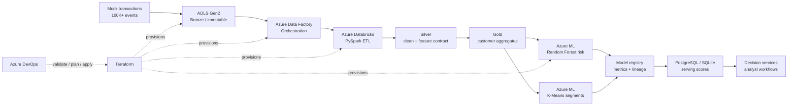

# Predictive Risk Intelligence Platform

An enterprise reference implementation for a governed Azure data and machine learning platform that converts high-volume transaction activity into explainable customer risk signals. The repository includes a synthetic data generator, Medallion-style transformations, supervised and unsupervised models, a serving export, Terraform infrastructure, Azure DevOps CI/CD, and pytest validation.

> **Design intent:** A risk signal is only useful when its lineage is visible.

## Architecture



| Layer | Responsibility | Primary artifacts |
|---|---|---|
| Bronze | Preserve raw events, source metadata, and replayability | `bronze_ingest.py` |
| Silver | Enforce schema, deduplicate, derive safe features | `silver_clean.py` |
| Gold | Aggregate customer-level features and risk scores | `gold_aggregate.py`, `medallion_pipeline.py` |
| ML | Train default-risk classifier and behavioral segments | `train_risk_model.py`, `segmentation_kmeans.py` |
| Serving | Export scores to a relational decision surface | `export_serving.py` |
| IaC | Reprovision Azure estate with tags and managed identities | `terraform/main.tf` |
| CI/CD | Lint, test, validate, plan, and gated apply | `ci_cd/azure-pipelines.yml` |

## Repository map

```text
terraform/                  Azure Resource Manager infrastructure via Terraform
src/utils/                  Synthetic data and serving export utilities
src/pipelines/              Bronze / Silver / Gold transformations
src/ml_models/              Risk model and K-Means segmentation
 tests/                     Pytest contracts for data and ML features
ci_cd/                      Azure DevOps pipeline definition
docs/                       Additional runbooks and model cards
```

## Local setup

The reference implementation is intentionally executable without Azure credentials. Create a virtual environment, install the local dependencies, generate data, run the medallion flow, and execute the tests.

```bash
python -m venv .venv
source .venv/bin/activate
pip install pandas numpy scikit-learn pyarrow pytest sqlalchemy joblib
python -m src.utils.generate_transactions --rows 100000 --output data/bronze/transactions.parquet
python - <<'PY'
from src.pipelines.medallion_pipeline import run_local_pipeline
run_local_pipeline('data/bronze/transactions.parquet', 'data/medallion')
PY
python -m pytest tests -q
```

The local test contract covers scale and schema, duplicate removal, feature derivation, Gold risk bounds, precision/recall/AUC metric logging, and the K-Means silhouette score. The production equivalent swaps pandas IO for Delta tables and can run as Databricks jobs without changing the feature contract.

## Azure setup guide

### ADLS Gen2

Create or select a subscription and resource group, then deploy `terraform/main.tf` with a unique lowercase `storage_prefix`. The storage account is configured with hierarchical namespace enabled, ZRS replication, TLS 1.2, and a `risk-lake` filesystem. Create `bronze`, `silver`, `gold`, and `model-artifacts` directories with least-privilege ACLs. Assign the Data Factory and Databricks managed identities Storage Blob Data Contributor only on the filesystem scope.

### Azure Data Factory

Create a linked service to ADLS Gen2 using managed identity. Define a parameterized ingestion pipeline that lands source files into the Bronze path partitioned by `event_date` and `source_system`. Add a Databricks notebook activity for Silver and Gold transformations, pass the storage path as a parameter, and configure retry plus quarantine handling for malformed records. Publish changes from a feature branch only after the CI stage has passed.

### Azure Databricks

Attach a cluster policy that pins the runtime, enables autoscaling limits, and denies public IPs. Mount or access ADLS using Unity Catalog external locations in a production environment. Package the `src/pipelines` modules as a wheel or Databricks Repo, schedule Bronze → Silver → Gold as a job, and write Delta outputs with schema evolution disabled by default. Enable cluster logs and job-level observability before onboarding production data.

### Azure ML

Create the Azure ML workspace from Terraform, attach the Gold data asset, and register the feature contract. Train the Random Forest classifier and K-Means segmentation job with MLflow logging for precision, recall, ROC-AUC, and silhouette score. Promote only a model version that meets the institution's approved risk thresholds and has an attached model card, lineage, and approval record.

### Serving database

For local use, `export_serving.py` writes to SQLite. In Azure, point the same exporter at PostgreSQL or Azure SQL through a secret-backed SQLAlchemy connection URL. Publish a versioned `customer_risk_scores` table with `customer_id`, `risk_score`, model version, scoring timestamp, and segment ID. Use row-level security and private endpoints for the serving surface.

## Terraform and CI/CD

```bash
terraform -chdir=terraform init
terraform -chdir=terraform fmt -check -recursive
terraform -chdir=terraform validate
terraform -chdir=terraform plan
```

The Azure DevOps pipeline runs Python tests and compilation, then Terraform init, format, validation, and plan. The apply stage is gated behind the `risk-platform-prod` environment and runs only from `main`, keeping infrastructure changes reviewable and reversible.

## Security and governance notes

This repository uses synthetic records only. Replace all local credentials with Azure managed identity, Key Vault references, private networking, workspace RBAC, and centralized audit logs before handling regulated data. Add data retention, deletion, model bias, drift, and human override controls to the institution's governance process.

## References

[1]: https://learn.microsoft.com/azure/storage/blobs/data-lake-storage-introduction "Azure Data Lake Storage Gen2 introduction"
[2]: https://learn.microsoft.com/azure/databricks/lakehouse/ "Azure Databricks lakehouse documentation"
[3]: https://learn.microsoft.com/azure/machine-learning/concept-ml-pipelines "Azure Machine Learning pipelines"
[4]: https://developer.hashicorp.com/terraform/docs "Terraform documentation"
